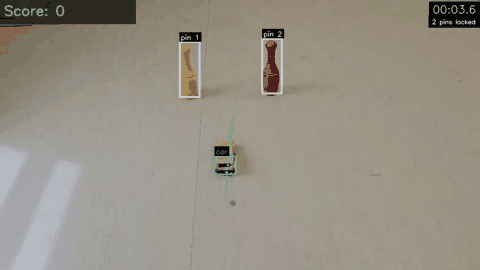
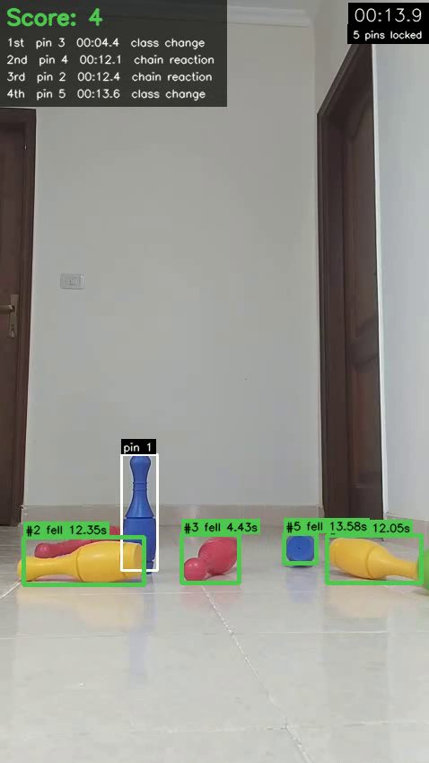
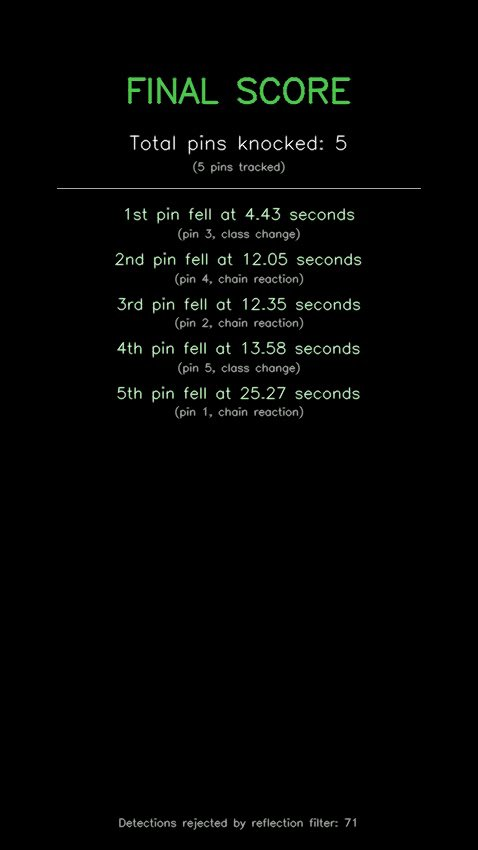
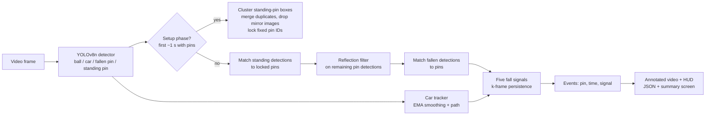
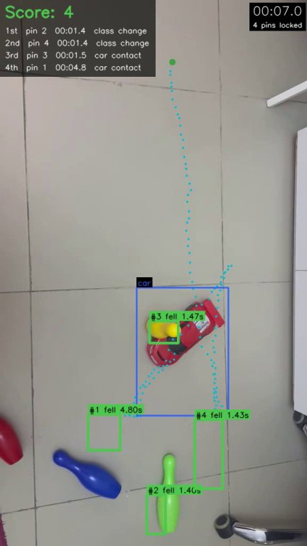

# Bowling Detection — Computer Vision

Pin-fall detection and timestamping with YOLOv8

Bowling Detection watches a video of a (toy) bowling setup and reports which pins fell and when. A YOLOv8n detector, fine-tuned on a custom 4-class dataset (ball, car, standing pin, fallen pin), finds the objects in each frame. A tracking pipeline then:

- locks each pin's position at the start;
- detects each fall with five independent signals, confirmed over several frames;
- outputs an annotated video, per-fall timestamps (JSON) and a final summary screen.

The same detector also runs offline on Android through TFLite.



*RC-car mode, low side view, hand-held camera: the car tips the yellow pin (car contact), then the red pin (car nearby, then the pin disappears). The clip ends on the summary screen.*

| Thrown-ball mode: side view, reflective floor | Final summary screen |
|---|---|
|  |  |

> **Scope:** the setup uses toy plastic pins on indoor floors, not a real bowling alley. Real-alley footage has different pins, distances, lighting and camera angles, so it would need new training data.

## Two play modes, one system

Both modes use the **same model** (`models/best.pt`) and the **same pipeline** (`analyze_video.py`); nothing is mode-specific.

| Mode | What knocks the pins | Evaluation videos |
|---|---|---|
| **(a) Thrown-ball bowling** | a ball rolled by hand at a row of 6 pins | `videobowling.mp4` (side view, reflective floor, 3 rolls) |
| **(b) RC-car bowling** (originally a course bonus task) | a remote-controlled car driven into the pins | `rc_car_side_view.mp4` (low side view, 2 pins); `first_video.mp4` (top-down, 4 pins) |

The car-based signals (contact, proximity, timeout) simply never fire in ball videos. There, falls are found by class transition and chain reaction.

## Android app (prototype)

[`android-app/`](android-app/) is a Kotlin app (minSdk 26, targetSdk 34) that runs the detector **offline on the device**:

- **Detection:** `TFLiteDetector.kt` runs a float32 TFLite export of the YOLOv8n model (320×320 input, YOLOv8 output decoding and per-class NMS).
- **Live camera:** a **CameraX** `ImageAnalysis` pipeline (`CameraAnalyzer.kt`) draws boxes, pin states and the car path over the preview.
- **Video upload:** `VideoAnalyzer.kt` analyzes a video picked from the gallery and shows the result.

**This is a prototype.** It uses an earlier, simpler tracker:

- `PinTracker.kt`: a pin is marked fallen on a standing → fallen class transition;
- `ScoreManager.kt`: a pin is also marked fallen when the car's center comes within 80 px of it.

It has **not** been updated to the five-signal logic, locked pin IDs or temporal confirmation described below, and it was not part of the evaluation.

**Build (verified):** `./gradlew assembleDebug` succeeds on Windows with the JDK bundled with Android Studio (JBR 21), Android SDK platform 34 and Gradle 8.5 via the included wrapper. The APK is not committed.

```bash
cd android-app
# point Gradle at your Android SDK (or set ANDROID_HOME); this file is git-ignored
echo "sdk.dir=/path/to/Android/Sdk" > local.properties
# Windows:  echo sdk.dir=C\:/Users/<you>/AppData/Local/Android/Sdk > local.properties
export JAVA_HOME="/path/to/Android Studio/jbr"   # any JDK 17-21
./gradlew assembleDebug                          # Windows: gradlew.bat assembleDebug
# -> app/build/outputs/apk/debug/app-debug.apk
adb install app/build/outputs/apk/debug/app-debug.apk
```

Or open `android-app/` in Android Studio and run it. The model and labels are already in `app/src/main/assets/`. To use newly trained weights, run `training/export_tflite.py` and copy `exports/bowling_model.tflite` and `exports/labels.txt` into that folder.

## Pipeline



### Pin identity (the over-counting fix)

An earlier script used YOLO tracker IDs. When a detection dropped out, the pin came back with a new ID and was counted again; it showed a score of 3 on a two-pin video. Now:

- **Setup** (1 s from the first frame with a standing pin): standing-pin boxes are clustered by center distance. A pin must appear in at least 30% of setup frames. Duplicates are merged, and IDs are assigned left to right.
- **Afterwards** every detection is matched to the nearest *locked* pin. Standing detections match within half a pin width, or when they lie ≥80% inside the locked box (a partly occluded pin). **No pin IDs are created after setup.**
- A matched standing detection of the *same shape* pulls the locked box slowly toward it (EMA, α = 0.05). This follows a drifting hand-held camera without letting a tipping pin drag its anchor.
- A pin can be marked fallen **once**.

### The five fall signals

Each signal is implemented in [`pin_tracker.py`](src/bowling_cv/pin_tracker.py), logged when it fires, and covered by a unit test in [`tests/`](tests/).

| # | Signal (`signal` in JSON) | Fires when |
|---|---|---|
| 1 | `class_transition` | a "fallen pin" box overlapping the pin, with no standing detection of it, for k consecutive frames |
| 2 | `car_contact` | the padded car box overlaps the pin for k consecutive frames |
| 3 | `proximity_disappearance` | the standing pin is missing for N frames and the car was near it within the last 1 s |
| 4 | `chain_reaction` | an already-fallen pin overlapped it within the last 1 s, then it went missing for N frames or was seen fallen for k frames |
| 5 | `timeout` | the standing pin is missing for more than T = 2 s after the car came within 4 pin lengths |

- **Tie-breaking:** if several signals fire in the same frame, the first in the order 2, 4, 1, 3, 5 is recorded. The others are listed in `also_satisfied`.
- **Timing:** `time_s` is the *onset* of the evidence (the first frame of the streak). `confirm_time_s` is when the signal was confirmed, which is also when the fall appears on the HUD.
- **Occlusion:** while the car box covers a pin's center, that pin is not counted as missing.
- **Settings:** k = 8 frames and N = 8 frames. All thresholds live in [`config.py`](src/bowling_cv/config.py) and scale with pin size, so they work at any resolution.

### Reflective-floor filter

[`reflection.py`](src/bowling_cv/reflection.py) has two parts:

- **Spatial.** A pin detection is rejected as a *mirror image* if it:
  - lies mostly (≥60%) below the bottom edge of a pin that is detected standing in the same frame;
  - overlaps that pin horizontally (≥50%);
  - has a similar width;
  - touches or nearly touches the pin's base.

  Setup candidates that are mirrors of another candidate are never locked. When the locked pins form a row, a floor line is fitted through their bottom edges, and detections whose center is more than one pin length below it are rejected. Every rejection is logged with its reason and written to the JSON.
- **Temporal.** A fall signal must persist for k consecutive frames. Flickering detections fail this.

`--no-reflection-filter` turns off **both** parts (spatial rules off, k = 1).

## Results

### Detector (YOLOv8n, 320 px, run stopped after 81 of 100 epochs)

From [`training/results_bowling_v4.csv`](training/results_bowling_v4.csv), best epoch (58). The per-class values were reproduced with `training/validate.py`.

| | mAP50 | mAP50-95 | Precision | Recall |
|---|---|---|---|---|
| all classes | **0.666** | 0.457 | 0.699 | 0.628 |

| Class | AP50 | Val instances |
|---|---|---|
| fallen pin | 0.768 | 88 |
| standing pin | 0.695 | 149 |
| ball | 0.645 | 4 |
| car | 0.558 | 8 |

Validation and test are the **same 28-image split**: the dataset's `data.yaml` sets `test` = `val`, so these are validation numbers with no separate held-out test set. With only 4 ball and 8 car instances, the ball and car AP values are very noisy.

### Fall detection on real videos

Three raw videos were annotated by hand, frame by frame; see [`eval/ground_truth.json`](eval/ground_truth.json). The videos themselves are not in the repo. [`evaluate.py`](evaluate.py) runs the full pipeline with and without the filter.

A detected fall counts as **correct** if that pin really fell and the time is within ±1 s. Every other detection is **false**, and a true fall with no correct detection is **missed**.

**Summary by camera view** (default settings, filter ON):

| Camera view | Videos | True falls | Correct | False | Missed |
|---|---|---|---|---|---|
| **Side view** | `rc_car_side_view.mp4`, `videobowling.mp4` | 8 | **7** | **0** | 1 |
| **Top-down** | `first_video.mp4` | 3 | 2 | 2 | 1 |

**Per video, with and without the reflection filter** (from [`eval/results.md`](eval/results.md)):

| Video | Mode / setup | True falls | Filter ON: detected / correct / **false** / missed | Filter OFF: detected / correct / **false** / missed | Spatial-filter rejections |
|---|---|---|---|---|---|
| `first_video.mp4` | RC car, top-down, 4 pins | 3 | 4 / 2 / **2** / 1 | 4 / 1 / **3** / 2 | 0 |
| `rc_car_side_view.mp4` | RC car, low side view, 2 pins, hand-held camera drifts | 2 | 2 / 2 / **0** / 0 | 2 / 2 / **0** / 0 | 6 |
| `videobowling.mp4` | thrown ball, side view, reflective floor, 6 pins, 3 rolls | 6 | 5 / 5 / **0** / 1 | 5 / 4 / **1** / 2 | 71 |
| **Total** | | 11 | 11 / 9 / **2** / 2 | 11 / 7 / **4** / 4 | |

**Per event** (filter ON):

| Video | Pin | Detected (s) | True (s) | Signal | Verdict |
|---|---|---|---|---|---|
| `first_video.mp4` | blue | 1.40 | 3.10 | class_transition | false |
| `first_video.mp4` | green | 1.43 | 2.00 | class_transition | correct |
| `first_video.mp4` | yellow | 1.47 | - (never falls) | car_contact | false |
| `first_video.mp4` | red | 4.80 | 5.70 | car_contact | correct |
| `rc_car_side_view.mp4` | yellow | 4.26 | 4.55 | car_contact | correct |
| `rc_car_side_view.mp4` | red | 9.97 | 10.15 | proximity_disappearance | correct |
| `videobowling.mp4` | red (front) | 4.43 | 4.60 | class_transition | correct |
| `videobowling.mp4` | right yellow | 12.05 | 12.80 | chain_reaction | correct |
| `videobowling.mp4` | left yellow | 12.35 | 12.70 | chain_reaction | correct |
| `videobowling.mp4` | right blue | 13.58 | 12.60 | class_transition | correct |
| `videobowling.mp4` | left blue | 25.27 | 25.30 | chain_reaction | correct |

**What the filter actually did.** Turning the filter on cut false falls from 4 to 2. An ablation on the same cached detections shows that **all of that improvement comes from temporal confirmation (k = 8), not from the spatial reflection rules:**

| Configuration | Correct / false (first_video / rc_car_side_view / videobowling) |
|---|---|
| spatial + temporal (default) | 2/2, 2/0, 5/0 |
| temporal only (k = 8, no spatial rules) | 2/2, 2/0, 5/0 |
| spatial only (k = 1) | 1/3, 2/0, 4/1 |
| neither | 1/3, 2/0, 4/1 |

I inspected the spatial rejections frame by frame. In these videos YOLO never detected an actual floor reflection as a pin, at conf 0.30. The rejected boxes were:

- the ball, mislabelled "standing pin" (most of the 71 in `videobowling.mp4`; see [screenshot](docs/rejected_ball_mirror_rule.jpg));
- a fallen pin lying in front of a standing one (already counted, so harmless here);
- the car, mislabelled "fallen pin" (the 6 in `rc_car_side_view.mp4`).

The spatial rules are implemented and unit-tested on synthetic mirror detections, but they have not been shown to help on real footage. They can also reject a real object lying directly in front of a standing pin.

**Top-down failure case.** 

In `first_video.mp4` YOLO labels the upright blue pin "fallen" for over a second (false `class_transition` at 1.40 s; it really falls at 3.1 s). The car also brushes the yellow pin without knocking it over (false `car_contact` at 1.47 s).

An earlier version of this project reported 4 falls at 1.50, 2.00, 2.57 and 3.47 s for this video. Frame-by-frame inspection shows 3 falls: green ~2.0 s, blue ~3.1 s, red ~5.7 s. The yellow pin is pushed but stays upright.

## Output

`analyze_video.py` writes to `--out` (default `outputs/`):

- `<video>_annotated.mp4` at the **source frame rate**. It shows locked pins (white = seen standing, grey = not seen this frame), fallen pins (green, with fall time), the car box and its dotted path, and spatially rejected detections (dashed magenta). The HUD lists each fall with `mm:ss.s` and its signal. A final summary screen ("1st pin fell at X.XX seconds …") is appended for 3 s.
- `<video>_events.json` contains:
  - `events` (`pin_id`, `time_s`, `signal`, `confirm_time_s`, …);
  - `rejected_reflection_count`, `rejected_by_reason` and each rejected detection;
  - locked pin boxes.
- `<video>.log`, a full DEBUG log, including every rejection and signal streak.

## How to run

Tested with Python 3.11 on Windows, CPU only.

```bash
python -m venv .venv
.venv\Scripts\activate            # Linux/macOS: source .venv/bin/activate
pip install -r requirements.txt

python analyze_video.py --video path/to/clip.mp4                 # outputs/clip_annotated.mp4 + clip_events.json
python analyze_video.py --video path/to/clip.mp4 --no-reflection-filter --show
python live_camera.py --camera 0                                 # webcam; Q quit, R re-lock pins, S screenshot
python evaluate.py --videos-dir path/to/videos                   # videos listed in eval/ground_truth.json
python -m pytest                                                 # 25 unit tests
```

`analyze_video.py` options: `--video`, `--conf` (pin/ball confidence, default 0.30), `--out`, `--show`, `--no-reflection-filter`, `--model` (default `models/best.pt`), `--log-level`.

On this laptop CPU the analyzer runs at roughly real time for 30 fps, ~500-px-wide video.

### Training

```bash
echo ROBOFLOW_API_KEY=your_key > .env        # never committed (.gitignore)
python training/download_dataset.py          # -> training/dataset/
python training/train.py                     # YOLOv8n, 320 px, bowling_v4 settings
python training/validate.py --weights models/best.pt
python training/export_tflite.py             # -> exports/bowling_model.tflite + labels.txt
```

`models/best.pt` (24.5 MB) is the `bowling_v4` checkpoint used for all results above.

## Limitations

- **Top-down labels are unreliable.** The training images are mostly side views. From above, an upright pin is a round blob and a lying pin looks like a side-view silhouette, so the standing/fallen classes do not transfer. This causes both false falls in `first_video.mp4`.
- **Merged pins.** The two adjacent red pins in `videobowling.mp4` overlap and are detected as one box, so they were merged into one tracked pin. The second red pin's fall is the one missed fall in the side-view results.
- **Tuned, indicative results.** k = 8 was chosen on the same three videos that are evaluated, and there are only 11 true falls in total. The numbers are indicative, not a held-out benchmark.
- **Reflection filter.** The spatial reflection rules did not reduce false falls on these videos. Temporal confirmation did (4 → 2 false falls).
- **Small dataset.** 535 images in the Roboflow export, including 4× augmented copies of the training images. Validation and test are the same 28-image split, with only 4 balls and 8 cars.
- **Toy setup, not a real alley.** Plastic pins, a small RC car or a light ball, indoor floors. Real bowling-alley footage would need new training data.
- **Heuristics.**
  - Car contact assumes a touched pin falls, which is false when the car only nudges it.
  - Timing is the onset of the evidence and can lead the visible fall by up to ~0.75 s.
  - Setup assumes the pins are standing and undisturbed in the first second in which they are detected.
- **Android app** is a prototype with the earlier, simpler tracker (see [above](#android-app-prototype)).
- **Webcam script.** `live_camera.py` shares all modules with the video analyzer. Its clock-based pipeline was exercised on video frames, but it has not been run against a live camera.
